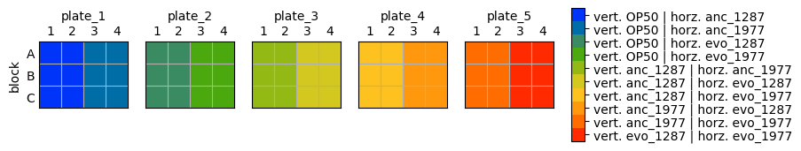
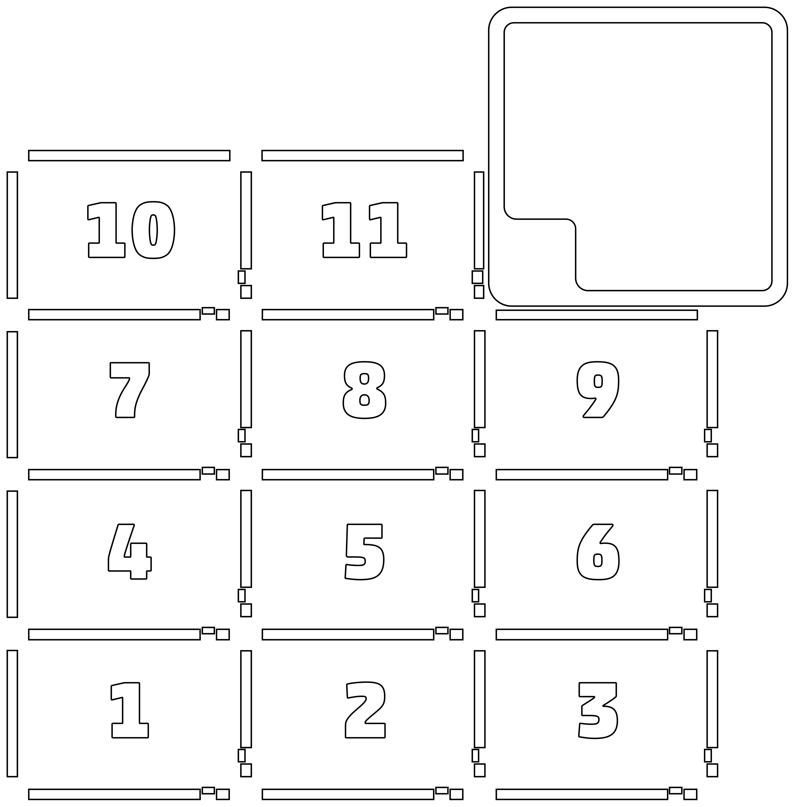

# Introduction

In this protocol we will use 12 well G

We will follow a similar approach to **Shtonda & Avery. J Exp Biol (2006). 209 (1): 89–102. doi: [https://doi.org/10.1242/jeb.01955](https://doi.org/10.1242/jeb.01955)**. To test whether worms would seek out better food (showing preference), the authors placed several hundred naive L1s on plates containing spots of two different types of bacteria. Without exception, more worms were found in the better food after a period of foraging [[WormBook]](https://www.ncbi.nlm.nih.gov/books/NBK116080/). We want to use this approach to see if C. elegans has different food preference for the most abundant bacterial species from our experiment (ancestral and evolved *Citrobacter koseri* 1287 and *Pseudomonas chlororaphis* 1977).

# Reagents

- NGM agar in 12- or 6-well plates
- PPY or similar media for growing bacterial cultures

# Equipment

- [Opentrons P20 Single Channel Electronic Pipette (GEN2)](https://shop.opentrons.com/single-channel-electronic-pipette-p20/). This should be fixed on the
  **LEFT** pipette mount.
- [Opentrons OT-2 96 Tip Rack - 20 µL](https://shop.opentrons.com/opentrons-20-l-tips-160-racks-800-refills/)
- Greiner Cellstar 12 well plates (Cat. No 665180). See custom labware definition
  `greiner_12_wellplate_2ml_flat`. These are where the bacteria and worms will be spotted.
- Sarstedt 6 well plates (Cat 83.3920) `sarstedt_6_wellplate_4ml_flat`. These hold the liquid
  bacteria cultures.

# Procedure

1. Open the jupyter notebook `01_organize_layout.ipynb`. Here you can experiment with how many species to use and the orientation they will be spotted on the 12 well plates. It will also allow you to write a metadata file so that you will know which species are in which well for which plates. **Important:** the plates should be numbered numerically and these numbers should match up with the deck layout positions. But **WATCH OUT** for zero based indexing in Python which will mean that plate 1 is actually plate 0 when you are working with scripts. You can also produce an image of the plate layout in this notebook (see below). Here the colors represent different species combinations and which species goes in the vertical versus horizontal orientation

1. Prepare the 12 well plates with NGM agar, adding enough to cover 1-2 cm on the bottom. Don't pour any thicker than you would a standard petri dish. Also grow the required bacterial species overnight in 6 ml vials so that they are ready to be spotted the next day.
2. The next day add the bacteria to be spotted into the 6 well plate. **IMPORTANT:** make sure the well arrangement in the 6 well plate is the same as what was used in the scripts. You should proceed from A1, B1, A2, B2, A3, B3 with the order of bacteria in the variable `species_names`.
3. Add the required number of plates determined from `01_organize_layout.ipynb` to the OT-2 deck. You should start from position 1 on the deck and increase sequentially. See below for a picture of the deck layout. A tip box should be in position 11 and the 6-well plate with bacteria should be in position 10.

1. Open the script `02_spot_bacteria.py` and edit the experiment-specific information at line 140 and below to match what you used in `01_organize_layout.ipynb`. Once all the plates and tips are arranged on the deck run the `02_spot_bacteria.py` script to perform the spotting. When the protocol is finished remove the plates and incubate at room temperature overnight to allow the bacterial spots to grow.
2. After obtaining the solution of synchronized L1 larvae, proceed with running the `03_spot_worms.py` script. For each chunk of wells, this script will have the OT-2 first rinse with a solution of Triton X100 to minimize the worms sticking to the plastic tip. Then it will aspirate 20 ul of C elegans L1 solution and pipette 1 ul at the center of each well for each 6-replicate chunk for each plate.

# Ancestral/evolved HAMBI_1287 and HAMBI_1977 experiment

| Species      | Evolution | Well (6-well plate) |
|--------------|-----------|---------------------|
| E. coli OP50 |           | A1                  |
| HAMBI_1287   | ancestral | B1                  |
| HAMBI_1977   | ancestral | A2                  |
| HAMBI_1287   | evolved   | B2                  |
| HAMBI_1977   | evolved   | A3                  |

https://blog.bioartbot.org/howto/
https://github.com/BioArtBot/bioartbot/blob/master/web/robot/ART_TEMPLATE.py